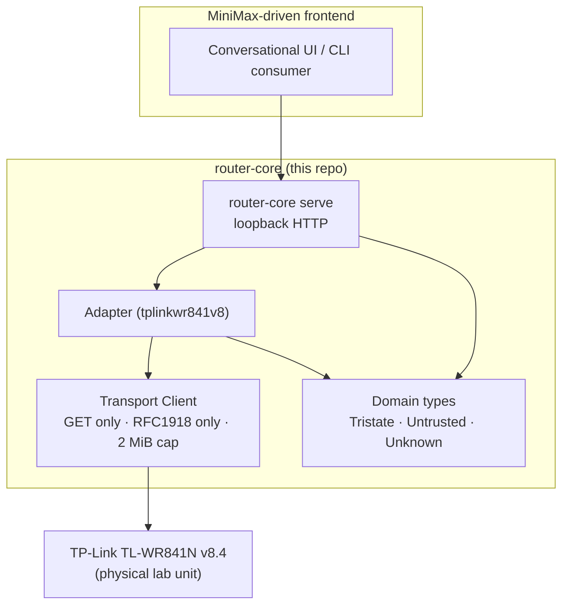

# router-core

[](.github/workflows/ci.yml)
[](https://goreportcard.com/report/github.com/Quiarom/router-core)
[](LICENSE)
[](go.mod)
[](https://www.gmicloud.ai/minimax-week)

> Local-first, read-only observation layer for legacy consumer
> routers, with a typed HTTP surface for an AI reasoning layer to
> consume. Submission for the **GMI Cloud × MiniMax Week**
> (track: **Reasoning**).
>
> **MiniMax models used:** `MiniMax-M3` (primary reasoning,
> coding, 1M ctx) and `MiniMax-M2.7` (low-latency fallback),
> served by [GMI Cloud](https://www.gmicloud.ai) via the
> OpenRouter gateway. Supporting infrastructure (router, transport,
> fixtures, tests) uses the open-source stack listed below.

---

## Table of contents

1. [What is this?](#what-is-this)
2. [Why it exists](#why-it-exists)
3. [Features](#features)
4. [Quickstart](#quickstart)
5. [Installation](#installation)
6. [Usage](#usage)
7. [Architecture](#architecture)
8. [Repository layout](#repository-layout)
9. [Safety invariants](#safety-invariants)
10. [Known runtime limitations (v8.4 firmware)](#known-runtime-limitations-v84-firmware)
11. [What's verified](#whats-verified)
12. [Development](#development)
13. [Testing](#testing)
14. [Roadmap](#roadmap)
15. [Contributing](#contributing)
16. [Attribution and third-party notices](#attribution-and-third-party-notices)
17. [License](#license)
18. [Citation](#citation)
19. [Support and security](#support-and-security)

---

## What is this?

`router-core` is a local-first, read-only observation layer for
legacy consumer routers. The current target is the **TP-Link
TL-WR841N/ND v8.4** stock dashboard (firmware
`3.13.33 Build 130506 Rel.48660n`). Other vendor families can grow
from the same domain types.

It authenticates against the device, parses the firmware's
`var name = new Array(...)` JavaScript dashboards deterministically,
and exposes a typed HTTP API on the loopback interface for a
downstream AI agent (a MiniMax-driven frontend, a CLI consumer,
or a small Go program) to consume.

`router-core` **cannot** change the router's settings, reboot it,
or do anything destructive. The mutation path is unrepresentable
in the type system.

## Why it exists

Stock consumer-router dashboards from 2013 are not getting
maintained. The web UI is ugly, missing features, and assumes a
user willing to click through six pages to answer "is my network
exposed?" `router-core` turns the dashboard into a typed API and
lets a reasoning model answer that question in plain language
without the user ever touching a login form.

## Features

- **Verified authentication recipe** (Basic Auth with plaintext
  password, NOT md5hex) — captured against the physical lab unit
  on 2026-08-30 and documented in
  [ADR 0005](docs/adr/0005-verified-wr841n-auth-recipe.md).
- **Six read-only capabilities** verified end-to-end against the
  physical lab unit on 2026-08-31: device, status, clients,
  wireless security, DMZ, forwarding.
- **Three capabilities reported as unsupported** on this firmware
  build (HTTP 501): WPS, UPnP, Remote Management.
- **Hard safety boundaries enforced in code:**
  - GET only. Every other method is rejected by the transport
    layer's `Client.Dispatch`.
  - Loopback or RFC1918 only. Public IPs and DNS hostnames are
    refused at every layer.
  - 2 MiB response body cap.
  - No cross-host redirects.
  - Mutations are unrepresentable: no `CapMutate` constant exists
    in any package runtime code imports.
- **`Unknown` is first-class.** Absent fields stay `unknown` (or
  an invalid optional integer), never silently `false`. Network-
  originated text is wrapped in `Untrusted` with a `trust:
  "untrusted"` marker, sanitized for display, never treated as
  instructions.
- **Three layers, vendor-neutral at the bottom:**
  1. `internal/domain/` — vendor-neutral types and the
     `RouterAdapter` contract.
  2. `internal/transport/` — guarded HTTP client.
  3. `internal/adapters/tplinkwr841v8/` — vendor-specific code
     for the WR841N v8.4.
- **Two binaries:**
  - `router-core` — runtime CLI: `probe`, `inspect`, `serve`.
  - `router-core-learn` — experimental probe and observation
     capture (5 candidate recipes, sanitized output to
     `fixtures/captured/`).
- **Fixture-backed adapter** for testing without hardware.
- **CI** with `gofmt`, `vet`, `build`, `go test -race`.

## Quickstart

```bash
# 1. Clone
git clone https://github.com/Quiarom/router-core.git
cd router-core

# 2. Build
go build -o ./bin/router-core ./cmd/router-core
go build -o ./bin/router-core-learn ./cmd/router-core-learn

# 3. Probe a synthetic fixture (no hardware required)
./bin/router-core probe --fixtures fixtures/synthetic/tplink-wr841n-v8

# 4. Probe the physical lab unit
./bin/router-core probe --host 192.168.1.1

# 5. Serve a typed HTTP API on loopback for the AI frontend
echo 'admin' | ./bin/router-core serve --host 192.168.1.1 --addr 127.0.0.1:8484
# In another shell:
curl http://127.0.0.1:8484/healthz
curl http://127.0.0.1:8484/v0/device
```

## Installation

### Requirements

- **Go 1.25 or newer.** Check with `go version`.
- A POSIX shell. Tested on Linux (Arch) and macOS.
- A TP-Link TL-WR841N/ND v8.4 on the local network for live
  authentication. Synthetic fixtures work without hardware.
- No other system dependencies. The HTTP client is stdlib-only.

### Install from source

```bash
go install github.com/Quiarom/router-core/cmd/router-core@latest
go install github.com/Quiarom/router-core/cmd/router-core-learn@latest
```

This puts the binaries in `$GOBIN` (usually `~/go/bin`). Make
sure that directory is on your `PATH`.

### Build from a clone

```bash
git clone https://github.com/Quiarom/router-core.git
cd router-core
make build           # or: go build -o ./bin/... ./cmd/...
```

See the [Makefile](Makefile) for `make build`, `make test`,
`make vet`, `make fmt`.

## Usage

### Subcommands

| Command | Purpose |
| --- | --- |
| `router-core probe` | Talk to the live router or a synthetic fixture and print the structured observation. |
| `router-core inspect` | Print the parsed router status, security, and clients as a single JSON document. |
| `router-core serve` | Authenticate against the router and expose a typed HTTP API on the loopback interface. |
| `router-core-learn learn` | Run the 5-recipe auth probe against the physical unit, write sanitized evidence. |
| `router-core-learn observe` | Run the per-capability observation matrix and update `capability-evidence.json`. |

### `probe` against the live router

```bash
./bin/router-core probe --host 192.168.1.1
# or as JSON
./bin/router-core probe --host 192.168.1.1 --json
```

### `probe` against a synthetic fixture

```bash
./bin/router-core probe --fixtures fixtures/synthetic/tplink-wr841n-v8
./bin/router-core probe --fixtures fixtures/synthetic/tplink-wr841n-v8 --json
```

### `serve` for the AI frontend

```bash
# Prompts for the admin password on /dev/tty (no echo).
# For unattended runs, pipe via --password-stdin (router-core-learn
# only; serve always reads from /dev/tty for safety).
./bin/router-core serve --host 192.168.1.1 --addr 127.0.0.1:8484
```

Endpoints exposed by `serve`:

| Path | Method | Response |
| --- | --- | --- |
| `/healthz` | GET | `200 {"state":"ok"}` |
| `/v0/device` | GET | `200 DeviceInfo` (vendor, model, firmware, hardware, provenance) |
| `/v0/status` | GET | `200 RouterStatus` or `503 unavailable` if session token is missing |
| `/v0/clients` | GET | `200 {state, clients[]}` or `503 unavailable` |
| `/v0/security/wireless` | GET | `200` or `404 unsupported_or_unverified` |
| `/v0/security/wps` | GET | `404 unsupported_or_unverified` on v8.4 |
| `/v0/security/dmz` | GET | `200 {state, dmz_enabled, dmz_host}` or `503 unavailable` |
| `/v0/security/upnp` | GET | `404 unsupported_or_unverified` on v8.4 |
| `/v0/security/remote-management` | GET | `404 unsupported_or_unverified` on v8.4 |
| `/v0/security/forwarding` | GET | `200 {state, forwarding_rules}` or `503 unavailable` |

### Environment variables

| Variable | Effect |
| --- | --- |
| `ROUTER_ALLOW_UNVERIFIED=1` | Explicitly permits requests to unverified local endpoint recipes. **Off by default.** |
| `ROUTER_LIVE_TESTS=1` | Opts into the conservative local integration test that hits the live router. |
| `OPENROUTER_API_KEY` | Required if the MiniMax reasoning layer is wired through OpenRouter (frontend integration). Not read by `router-core` itself. |

## Architecture



The **domain layer** is vendor-neutral. The **transport layer**
is the hard safety boundary. The **adapter layer** knows the
vendor. A second adapter for, say, an ASUS or MikroTik device
can be added without touching `internal/domain/` or
`internal/transport/`.

## Repository layout

```
.
├── cmd/
│   ├── router-core/         # runtime CLI: probe, inspect, serve
│   └── router-core-learn/   # experimental probe + observation capture
├── internal/
│   ├── domain/              # vendor-neutral types
│   ├── transport/           # guarded HTTP client
│   ├── adapters/
│   │   ├── fixture/         # fixture-backed adapter
│   │   └── tplinkwr841v8/   # vendor-specific code
│   └── architecture_test.go # get-only safety invariant
├── fixtures/
│   ├── synthetic/           # synthetic dashboard pages
│   └── captured/            # sanitized physical-lab captures
├── docs/
│   ├── adr/                 # architecture decision records
│   ├── archive/             # historical docs
│   ├── STATUS.md            # non-engineer project status
│   ├── PHASE2_OUTCOMES.md
│   ├── PRIOR_ART_PROTOCOL.md
│   └── SDD.md
├── .github/
│   ├── workflows/ci.yml
│   ├── ISSUE_TEMPLATE/
│   └── PULL_REQUEST_TEMPLATE.md
├── HACKATHON_FAQ.md         # MiniMax-Week judging details
├── CODE_OF_CONDUCT.md
├── AGENTS.md                # notes for AI coding agents
├── CONTRIBUTING.md          # (recommended) contribution guide
├── CHANGELOG.md
├── LICENSE                  # MIT
├── NOTICE                   # third-party attribution
├── Makefile
└── README.md                # this file
```

## Safety invariants

- **GET only.** `internal/transport.Client.Dispatch` rejects every
  other method. Enforced by
  [`internal/architecture_test.go`](internal/architecture_test.go).
- **Loopback or RFC1918 only.** Public IPs and DNS hostnames are
  refused at every layer (`IsAllowedHost`, `isLoopbackAddr`,
  `isRFC1918OrLoopback`).
- **2 MiB response body cap.** Anything larger is truncated at
  the transport.
- **No cross-host redirects.**
- **In-memory session only.** `router-core serve` reads the admin
  password from `/dev/tty` with echo disabled, holds it only for
  the process lifetime, and zeroes it on exit.
- **Mutations are unrepresentable.** There is no `CapMutate`
  constant in any package runtime code imports. Any future
  mutation path requires a new ADR, capability constant, and
  explicit operator approval.

## Known runtime limitations (v8.4 firmware)

The TP-Link WR841N v8.4 firmware requires a 16-character session
token URL prefix (`/<token>/userRpm/<path>`) for several dashboard
endpoints. The `/` login response on this build does not return
the token; the verified Basic Auth recipe (ADR 0005) confirms the
session otherwise works. In practice this means:

- `serve` against this firmware returns `200` for `/healthz` and
  `/v0/device` (unauthenticated `Identify`).
- `/v0/status`, `/v0/clients`, and `/v0/security/dmz|upnp|
  remote-management|forwarding` return `503 unavailable` until the
  operator supplies the session token. WPS returns the expected
  `404 unsupported_or_unverified` (the endpoint returns HTTP 501
  on this firmware).
- The HTTP-501 endpoints (WPS, UPnP, Remote Management) are
  reported as `unsupported_or_unverified` even without the token
  because the firmware rejects them before the path is consulted.

The session-token plumbing exists in the adapter
(`authedFetchWithFallback`, `SessionTokenForTest`) but the
production path for fetching the token from this firmware has not
been written. The frontend should expect the `503 unavailable`
shape on the token-gated endpoints and surface a clear "session
expired, restart with token" hint.

## What's verified

The full per-capability matrix is in
[docs/STATUS.md](docs/STATUS.md). Authentication and six read-only
capabilities were verified against the physical lab unit on
2026-08-30 and 2026-08-31. Sanitized evidence is in
`fixtures/captured/`. The verified Basic Auth recipe is
documented in
[ADR 0005](docs/adr/0005-verified-wr841n-auth-recipe.md).

| Capability | Endpoint | State on v8.4 |
| --- | --- | --- |
| Authentication | `GET /` with `Authorization: Basic <base64(admin:plaintext)>` | verified 2026-08-30 |
| Status | `/userRpm/StatusRpm.htm` | verified 2026-08-31 |
| Wireless security | `/userRpm/WlanSecurityRpm.htm` | verified 2026-08-31 |
| Clients | `/userRpm/AssignedIpAddrListRpm.htm` | verified 2026-08-31 |
| DMZ | `/userRpm/DMZRpm.htm` | verified 2026-08-31 |
| Forwarding | `/userRpm/VirtualServerRpm.htm` | verified 2026-08-31 |
| WPS | `/userRpm/WpsRpm.htm` | unsupported (HTTP 501) |
| UPnP | `/userRpm/UpnpRpm.htm` | unsupported (HTTP 501) |
| Remote management | `/userRpm/AccessCtrlRpm.htm` | unsupported (HTTP 501) |

## Development

```bash
# Format
gofmt -w .

# Vet
go vet ./...

# Build all packages
go build ./...

# Run the full test suite
go test ./... -race
```

The Makefile wraps these and adds a `make ci` target that matches
the GitHub Actions workflow.

## Testing

Eight packages, all green. The tests do not require the physical
router — they use httptest sidecars that emulate the WR841N v8.4
firmware with the verified Basic Auth recipe.

```bash
go test ./... -race
# ok  github.com/Quiarom/router-core/cmd/router-core           0.015s
# ok  github.com/Quiarom/router-core/cmd/router-core-learn     0.058s
# ok  github.com/Quiarom/router-core/cmd/router-core-learn/sanitize  0.004s
# ok  github.com/Quiarom/router-core/internal                  0.005s
# ok  github.com/Quiarom/router-core/internal/adapters/fixture  0.005s
# ok  github.com/Quiarom/router-core/internal/adapters/tplinkwr841v8  0.009s
# ok  github.com/Quiarom/router-core/internal/domain           0.003s
# ok  github.com/Quiarom/router-core/internal/transport        0.106s
```

A separate live integration test (off by default) hits the
physical unit:

```bash
ROUTER_LIVE_TESTS=1 go test ./internal/adapters/tplinkwr841v8/... -run Live -v
```

## Roadmap

- **Phase 6 — One Safe Write.** Add the first mutation (e.g.
  disabling UPnP) gated by policy, verification, and explicit
  human approval. Requires ADR 0003 (capability authority) to
  move from DRAFT to active.
- **Per-firmware session-token fetch.** Implement the production
  path that reads the v8.4 session token from
  `/LoginRpm.htm?Save=Save` and forwards it to
  `authedFetchWithFallback`.
- **Frontend reference implementation.** A small TypeScript or
  SvelteKit frontend that talks to `serve` and to a MiniMax
  model through GMI Cloud via OpenRouter.
- **More adapters.** The vendor-neutral `RouterAdapter` contract
  is ready for an ASUS, MikroTik, or Ubiquiti implementation.

## Contributing

Please read [CODE_OF_CONDUCT.md](CODE_OF_CONDUCT.md) before
opening an issue or pull request. Contributions follow the
[Conventional Commits](https://www.conventionalcommits.org/)
format and require passing `gofmt`, `go vet`, and `go test -race`.

Issue templates are in
[.github/ISSUE_TEMPLATE/](.github/ISSUE_TEMPLATE/). The pull
request template is in
[.github/PULL_REQUEST_TEMPLATE.md](.github/PULL_REQUEST_TEMPLATE.md).

## Attribution and third-party notices

The **baseline implementation** of this project — the Go module
scaffolding, domain model, transport layer, parser layer,
fixture adapter, original CLI, tests, CI, ADRs 0001 and 0002, the
original `OVERNIGHT_REPORT.md`, and the `BLOCKED_CAPTURE.md`
capture handoff — was produced as an overnight autonomous pass
by **Devin AI** ([Cognition Labs](https://www.cognition.ai)).
The Devin-generated commits are the original branch
`feat/wr841n-readonly-adapter` from `cf1f0fe` (initial commit)
through `fe3c27b` (overnight implementation report). The
post-Phase-0 work — the verified auth recipe (commit `0ad9899`,
ADR 0005), the `router-core serve` runtime binary, the comment
cleanup, the `HACKATHON.md` / `NOTICE` / `CODE_OF_CONDUCT.md`
files, and the cleanup commits `3897a7b`, `a1936b0`, and
`5304028` — was produced by the router-core author and
collaborators, not by Devin. **Other AI coding agents
(MiniMax, Claude, GPT, etc.) may be used for supporting
infrastructure (parsers, tests, docs) during the
MiniMax-Week campaign; only the reasoning layer must use
MiniMax models served by GMI Cloud.**

Two public prior-art implementations were studied as **research
only, no code imported:**

- [`mkubicek/tpylink`](https://github.com/mkubicek/tpylink) — no
  declared license.
- [`maesoser/tplink_exporter`](https://github.com/maesoser/tplink_exporter) — GPL-3.0.
  **Code from this repository was NOT imported**; the GPL license
  would have forced the combined work under GPL, which contradicts
  the MIT target of this project.

The verified Basic Auth recipe (ADR 0005) **diverges** from both
prior-art implementations (which assumed md5hex hashing). The
divergence was discovered by physical capture, not by copying.
See [docs/PRIOR_ART_PROTOCOL.md](docs/PRIOR_ART_PROTOCOL.md) for
the full per-observation comparison and the full attribution in
[NOTICE](NOTICE).

## License

MIT. See [LICENSE](LICENSE).

## Citation

If you use this work in research or a hackathon, please cite it
as:

```bibtex
@software{router_core_2026,
  title  = {router-core: a local-first, read-only observation layer for legacy consumer routers},
  author = {Quiarom and contributors},
  year   = {2026},
  url    = {https://github.com/Quiarom/router-core},
  note   = {GMI Cloud × MiniMax Week 2026 submission (track Reasoning)}
}
```

## Support and security

- **Bug reports and feature requests:** use the issue templates
  in [.github/ISSUE_TEMPLATE/](.github/ISSUE_TEMPLATE/).
- **Security vulnerabilities:** please open a private security
  advisory on GitHub
  ([instructions](https://docs.github.com/en/code-security/security-advisories/guidance-on-reporting-and-writing-information-about-vulnerabilities/privately-reporting-a-security-vulnerability))
  rather than a public issue. We respond within 72 hours.
- **Hackathon judging details** for GMI Cloud × MiniMax Week:
  see [HACKATHON_FAQ.md](HACKATHON_FAQ.md).
